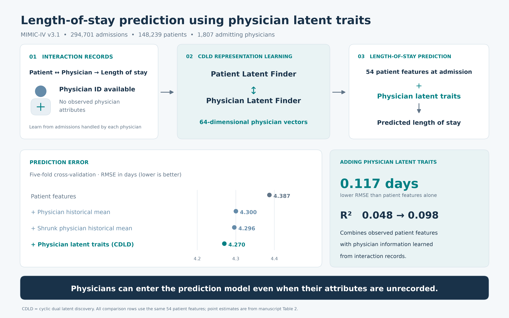

# CDLD-LoS — 의사 잠재특성을 이용한 재원일수 예측



[SVG](graphical_abstract/20261004_graphical_abstract.svg) · [Python source](graphical_abstract/20261004_graphical_abstract.py)

논문 「의사 잠재특성을 이용한 재원일수 예측」(심사 중)의 코드입니다.

MIMIC-IV에서 입원 담당 의사는 비식별 식별자로만 존재하고 **관측 특성이 하나도
없습니다** — 전공도, 경력도, 진료 구성도 없습니다. 이 저장소는 순환 이중 잠재특성
발견(CDLD)으로 **상호작용 기록만으로** 의사의 잠재특성을 발견하고, 입원 시점 환자
특성 54차원과 결합해 재원일수를 예측합니다.

English: [README.md](README.md)

## 무엇을 관측했나

| 무엇을 쓰는가 | RMSE (일) | R² | 연장 재원 AUROC |
|---|---|---|---|
| 아무것도 안 씀 (전체 평균) | 4.496 | 0.000 | 0.500 |
| **의사 식별자만** (과거 평균 재원일수, 모델 적합 없음) | **4.302** | **0.085** | 0.674 |
| 환자 특성 54개 | 4.387 | 0.048 | 0.686 |
| 환자 특성 + 의사별 과거 평균 | 4.300 | 0.085 | 0.710 |
| **환자 특성 + 의사 잠재특성** | **4.270** | **0.098** | **0.717** |

두 가지를 분명히 적어둡니다.

**의사 식별자 하나가 환자 변수 54개보다 많은 정보를 담습니다.** 모델 적합조차 없이
계산한 의사별 과거 평균 재원일수가, 인구학·보험·입원 경로·과거력을 합친 모델보다
높은 R²에 도달합니다.

**그 이득의 대부분은 표현 학습 없이도 얻어집니다.** 의사 정보를 추가해서 얻는
0.117일 중 0.090일(77%)은 의사별 과거 평균을 특성 한 컬럼으로 더하는 것만으로
재현됩니다. 64차원 잠재특성은 그 위에 나머지 0.027일(23%)을 추가합니다
(p < 0.001, 5개 fold 전부 같은 방향). 절대 크기는 입원당 약 40분으로 작으며,
방향이 일관된다는 점과 함께 읽어야 합니다.

**잠재특성 발견에는 경계조건이 있습니다.** 의사 잠재특성을 섞으면 RMSE가 0.192일
나빠지지만 환자 잠재특성을 섞으면 0.005일에 그칩니다. 학습 기록 수로 층화하면,
과거 기록이 없는 환자 층에서 환자 잠재특성의 기여는 정확히 0입니다. 개체당 상호작용
수가 잠재특성 발견의 성패를 결정하며, 그래서 설계가 비대칭입니다 — 환자는 관측
특성으로, 의사는 잠재특성으로.

> 위 수치는 논문에 보고한 5-fold 실행값입니다. `cdld_los.ipynb`가 다시
> 만들어내며, 실행 후 `tables/p_table2.csv`에서 확인할 수 있습니다.

## 데이터 준비

MIMIC-IV 전체를 받을 필요가 없습니다. `hosp` 모듈의 4개 파일만 있으면 됩니다.

```
MIMIC_DIR/
  admissions.csv.gz          # 입원·퇴원 시각, 입원 유형·경로, 인구학,
                             # admit_provider_id
  patients.csv.gz            # 성별, 연령
  omr.csv.gz                 # 혈압, 체격
  microbiologyevents.csv.gz  # 예약 — 현재 특성 집합에서는 사용하지 않음
```

MIMIC-IV v3.1은 PhysioNet에서 받을 수 있으며 자격 취득과 데이터 사용 동의가
필요합니다. **원자료도 파생 캐시도 재배포할 수 없으므로** 이 저장소에는 코드만
있습니다.

`diagnoses_icd`는 의도적으로 사용하지 않습니다. 진단 코드는 퇴원 시 부여되므로
쓰면 결과가 누수됩니다. 그래서 이 과제는 입원 시점 예측이며, 여기의 R²는 재원 중
데이터를 쓰는 연구와 직접 비교할 수 없습니다.

## 이 저장소에 없는 것

MIMIC-IV는 PhysioNet 데이터 사용 동의에 따라 재배포할 수 없고, 그로부터 파생된
record 단위 데이터도 마찬가지입니다. 노트북이 만드는 파일 중 **입원 건별 실제·예측
재원일수 배열**(산점도용) 두 개는 그래서 저장소에 넣지 않습니다. 원자료와 parquet
캐시도 같습니다. `.gitignore`가 이를 강제합니다.

논문의 수치를 읽는 데 필요한 것은 다 있습니다. **노트북에 실행 출력이 그대로
들어 있어** MIMIC 자격 없이도 모든 표와 그림을 확인할 수 있습니다. 처음부터
재현하려면 MIMIC-IV hosp 모듈 4개 파일에 대한 자격이 필요합니다.

## 노트북

| 노트북 | 하는 일 |
|---|---|
| `cdld_los.ipynb` | 논문의 모든 표를 한 번의 실행으로. `tables/p_table*.csv` 생성 |
| `backup.ipynb` | `tables/`·`figures/`·`artifacts/`를 tar.gz로. 나중에 그림만 다시 그릴 수 있게. MIMIC 자료와 캐시는 제외 |
| `cdld_los_tutorial.ipynb` | 가상 데이터로 도는 CDLD 최소 템플릿. CPU로 수 분. MIMIC 자격 불필요 |

### 논문 노트북 실행

1. 위 4개 파일을 `MIMIC_DIR`에 둡니다(상수 셀 맨 위에서 지정).
2. 전체 실행. GPU(RTX 4090) 기준 약 2~4시간입니다. 첫 실행에서 parquet 캐시를
   만들고 이후 실행은 재사용합니다.
3. 나눠 돌리려면 `RUN_MAIN` → `RUN_BASELINE` → `RUN_DIAG` → `RUN_FAIRNESS`
   순서를 지킵니다. 뒤 셋은 앞이 저장한 잠재특성과 분할을 읽습니다.
4. `QUICK = True`는 fold 0만 돕니다. 파이프라인 점검용이며 논문 수치가 아닙니다.

`[검정 전용]`·`[요약 전용]`·`[그림 전용]` 셀은 저장된 CSV만 읽습니다. 커널을
재시작해도 Setup·상수·progress 세 셀만 실행하면 표와 그림이 전부 재생성됩니다 —
재학습이 필요 없습니다.

### 방법 요약

Finder 두 개가 환자·의사 잠재특성 테이블을 공유하며 교대 학습합니다. 한 번에 한쪽만
열어두고 다른 쪽은 얼리며, 사이클마다 역할을 바꿉니다. 학습 종료는 사이클 단위로
판정하고 가장 좋았던 사이클의 잠재특성을 복원합니다. Predictor는 비대칭입니다 —
환자는 관측 특성 54차원, 의사는 잠재특성만.

하이퍼파라미터는 선행 CDLD 연구의 값을 그대로 썼고 이 데이터에 맞춰 조정하지
않았습니다. 학습률·학습 길이·잠재 차원을 바꾼 15개 설정의 별도 탐색에서 성능 편차는
0.033일(0.78%)이었고, 사전에 정한 문턱을 넘은 후보 하나는 시드를 바꾼 반복에서
유지되지 않아 원래 설정을 그대로 두었습니다.

## 요구 환경

Python 3.11, TensorFlow 2.19, scikit-learn, pandas, numpy, scipy, matplotlib,
seaborn, pyarrow. 학습기 4종 비교에는 xgboost, lightgbm, catboost가, SHAP 분석에는
shap이 추가로 필요합니다.

## 인용

논문 서지는 게재 후 추가합니다. CDLD 자체는 다음과 같습니다.

- Rim D, Nuriev S, Hong Y. *IEEE Access* 2025;13:10663–10677.
- Hong Y, Park S, Rim D. *IEEE Access* 2025. doi:10.1109/ACCESS.2025.3622159
- Park S, Kim S, Rim D. *Ewha Med J* 2025;48(2):e34.

MIMIC-IV를 사용하면 데이터 사용 동의에 따라 Johnson et al.(*Sci Data* 2023),
PhysioNet v3.1 프로젝트 페이지, Goldberger et al.(*Circulation* 2000)을 함께
인용해야 합니다.

## 라이선스

MIT — [LICENSE](LICENSE) 참조. 이 라이선스는 **코드에만** 적용됩니다. MIMIC-IV에
대한 권리는 부여하지 않으며, 해당 데이터는 PhysioNet이 자체 데이터 사용 동의에
따라 자격 보유자에게만 배포합니다.
